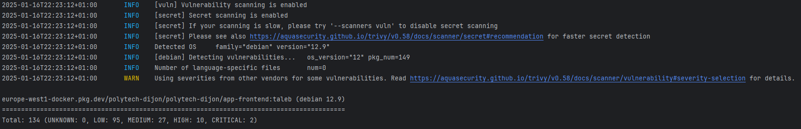
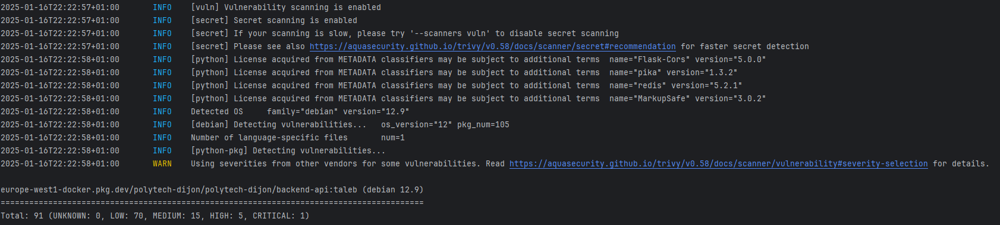
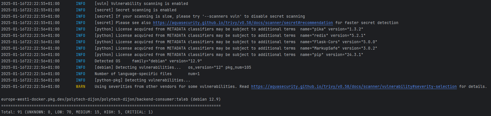

# Application
[](https://docs.docker.com/)
[](https://developer.mozilla.org/fr/docs/Web/HTML)
[](https://developer.mozilla.org/fr/docs/Web/CSS)
[](https://developer.mozilla.org/fr/docs/Web/JavaScript)
[](https://flask.palletsprojects.com/)
[](https://redis.io/)
[](https://rabbitmq.com/)
[](https://nginx.org/)

## Sommaire
- [Développement de l'application](#développement-de-lapplication)
- [Structure de données pour le stockage des calculs](#structure-de-données-pour-le-stockage-des-calculs)
- [Problèmes rencontrés](#problèmes-rencontrés)
- [Automatisation](#automatisation)
- [Docker](#docker)
    - [Création des images Docker](#création-des-images-docker)
    - [Scan des images avec Trivy](#scan-des-images-avec-trivy)
    - [Lancement des conteneurs](#lancement-des-conteneurs)
    - [Pousser les images dans le registry](#pousser-les-images-dans-le-registry)
    - [Vérification des images poussées](#vérification-des-images-poussées)
- [Voir aussi](#voir-aussi)

## Développement de l'application

- **Frontend :** HTML, CSS, JS
- **Backend :** Flask (Python)
- **Base de données :** Redis
- **Queue de message :** RabbitMQ
- **Serveur web :** Nginx

## Structure de données pour le stockage des calculs

Les calculs effectués par l'application sont stockés dans **Redis**, une base de données clé-valeur. La structure utilisée est la suivante :

- **Clé :** Un identifiant unique (UUID) `calc_id` généré pour chaque calcul.
- **Valeur :** le résultat `resul` du calcul.
```python
    redis_client.set(calc_id, result)
```

## Problèmes rencontrés

### Politique CORS :
- Les requêtes HTTP effectuées vers un domaine différent de celui de la page déclenchent un blocage par le navigateur. Cela est dû aux restrictions de sécurité qui limitent, par défaut, les échanges aux seules requêtes provenant de la même origine.
- **Solution :** Autoriser les requêtes provenant d'un autre domaine en ajoutant des entêtes CORS dans le backend.
```python
from flask_cors import CORS
CORS(app)
```
### RabbitMQ :
- Timeout des channels après 60s.
- **Solution:** mettre le paramètre `heartbeat` à 0 pour désactiver le timeout.
```python
connection = pika.BlockingConnection(pika.ConnectionParameters(host='rabbitmq', heartbeat=0))
```

### Docker :
- **RabbitMQ et Redis :** Ils ne reconnaissaient pas `localhost`.
- **Solution :** Remplacement par `host.docker.internal` dans `host` de connexion de Redis et RabbitMQ afin de tester l'application en local avant de la déployer à l'aide de Kubernetes.
```python
redis = Redis(host='host.docker.internal', port=6379, db=0)
connection = pika.BlockingConnection(pika.ConnectionParameters(host='host.docker.internal'))
```

- **Conteneur :** Problème de connexion entre les conteneurs.
- **Solution :** Ajout de `host = 0.0.0.0` et `port = 5000` dans le backend pour qu'il soit accessible depuis l'extérieur.
```python
app.run(host='0.0.0.0', port=5000, debug=True)
```

### Docker Compose :
- **RabbitMQ :** une fois le conteneur prêt, la création des conteneurs pour l'API et le consumer commence, mais le service RabbitMQ n'est pas encore lancé. Cela entraîne un échec dans la création des conteneurs pour l'API et le consumer qui dépendent de ce dernier.
- **Solution :** Ajout de l'option `healthcheck` pour attendre que RabbitMQ soit prêt. Ajout l'option `depends_on` pour vérifier les conditions de démarrage avant de lancer le conteneur de l'API et celui du consumer.
```yaml
    healthcheck:
      test: [ "CMD", "rabbitmq-diagnostics", "status" ]
      interval: 10s
      timeout: 10s
      retries: 5
```
```yaml
    depends_on:
      rabbitmq:
        condition: service_healthy
      redis:
        condition: service_started
```

## Automatisation

> [!NOTE]
> La création et le poussage des images Docker se font à l'aide de GitHub Actions. Plus de détails [workflow](../.github/workflows/build_push_images.yaml).

## Docker

### Création des images Docker

- #### Création de l'image app-frontend
```bash
docker build . -t europe-west1-docker.pkg.dev/polytech-dijon/polytech-dijon/app-frontend:taleb.latest
```

- #### Création de l'image backend-api
```bash
docker build . -t europe-west1-docker.pkg.dev/polytech-dijon/polytech-dijon/backend-api:taleb.latest
```

- #### Création de l'image backend-consumer
```bash
docker build . -t europe-west1-docker.pkg.dev/polytech-dijon/polytech-dijon/backend-consumer:taleb.latest
```
### Scan des images avec Trivy

- #### Scan de l'image app-frontend
```bash
trivy europe-west1-docker.pkg.dev/polytech-dijon/polytech-dijon/app-frontend:taleb.latest
```
- #### Résultat du scan de l'image app-frontend


- #### Scan de l'image backend-api
```bash
trivy europe-west1-docker.pkg.dev/polytech-dijon/polytech-dijon/backend-api:taleb.latest
```
- #### Résultat du scan de l'image backend-api


- #### Scan de l'image backend-consumer
```bash
trivy europe-west1-docker.pkg.dev/polytech-dijon/polytech-dijon/backend-consumer:taleb.latest
```
- #### Résultat du scan de l'image backend-consumer


### Lancement des conteneurs

- #### En utilisant Docker Compose
```bash
docker-compose up
```
ou
```bash
docker-compose up --build
```
- #### Lancement du service Redis
```bash
docker run --rm -p 6379:6379 --name myRedis redis
```

- #### Lancement du service RabbitMQ
```bash 
docker run -it --rm --name myRabbitmq -p 5672:5672 -p 15672:15672 rabbitmq:3.12-management
```

- #### Lancement du app-frontend
```bash
docker run --rm --name app-frontend -p 8080:80 europe-west1-docker.pkg.dev/polytech-dijon/polytech-dijon/app-frontend:taleb.latest
```

- #### Lancement du backend-api
```bash
docker run --rm --name backend-api -p 5000:5000 europe-west1-docker.pkg.dev/polytech-dijon/polytech-dijon/backend-api:taleb.latest
```

- #### Lancement du backend-consumer
```bash
docker run --rm --name backend-consumer europe-west1-docker.pkg.dev/polytech-dijon/polytech-dijon/backend-consumer:taleb.latest
```
### Pousser les images dans le registry
- #### Pousser app-frontend
```bash
docker push europe-west1-docker.pkg.dev/polytech-dijon/polytech-dijon/app-frontend:taleb.latest
```

- #### Pousser backend-api
```bash
docker push europe-west1-docker.pkg.dev/polytech-dijon/polytech-dijon/backend-api:taleb.latest
```

- #### Pousser backend-consumer
```bash
docker push europe-west1-docker.pkg.dev/polytech-dijon/polytech-dijon/backend-consumer:taleb.latest
```

### Vérification des images poussées
```bash
gcloud artifacts docker images list europe-west1-docker.pkg.dev/polytech-dijon/polytech-dijon
```

## Voir aussi
- [`Kubernetes/`](../Kubernetes) : Manifests Kubernetes (Replicaset, Service, Ingress).
- [`Foundation/`](../Foundation) : Terraform (provisionnement de l'infrastructure).
- [`Projet.md`](../README.md) : Description du projet.
- [`Sujet.md`](../Sujet.md) ou [source](https://github.com/JeromeMSD/module_virtualisation-et-cloud-computing/blob/main/projet.md).
- [🔼 Back to Top](#application)
