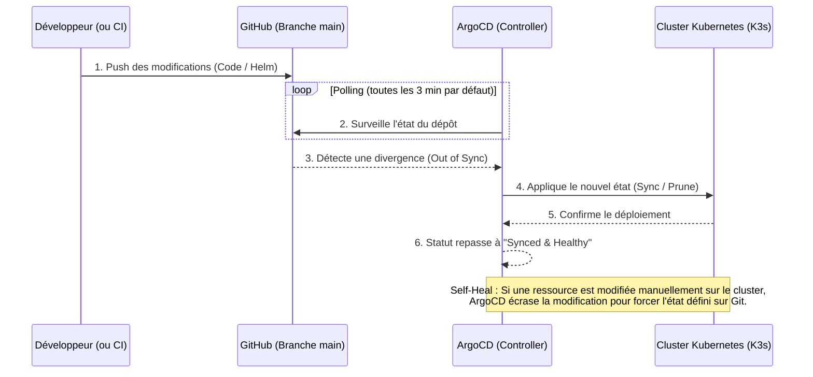

# GitOps & ArgoCD
[](https://argo-cd.readthedocs.io/en/stable/)
[](https://www.gitops.tech/)
[](https://docs.github.com/en/actions)
[](https://registry.terraform.io/providers/oracle/oci/latest/docs)

## Sommaire
- [Introduction](#introduction)
- [Schéma de Fonctionnement](#schéma-de-fonctionnement)
- [Configuration de l'Application](#configuration-de-lapplication)
- [Déploiement](#déploiement)
- [Guide d'accès à l'interface graphique d'ArgoCD](#guide-daccès-à-linterface-graphique-dargoCD)
- [Voir aussi](#voir-aussi)

## Introduction

La philosophie **GitOps** consiste à utiliser un dépôt Git comme unique source de vérité pour les configurations d'infrastructure et d'applications. 

Dans ce projet, nous utilisons **ArgoCD** (qui a d'ailleurs été installé automatiquement sur notre cluster K3s par le script cloud-init de Terraform). ArgoCD surveille en permanence notre dépôt GitHub et s'assure que l'état du cluster Kubernetes correspond exactement à ce qui est défini dans notre code.

## Schéma de Fonctionnement

Voici comment s'articule le flux de déploiement continu (CD) avec ArgoCD :



## Configuration de l'Application (Pattern App of Apps)

Ce dossier utilise le pattern **App of Apps** pour gérer une architecture microservices.

1. **Le fichier racine (`root-app.yaml`) :** C'est une application "parapluie". Au lieu de pointer vers un Chart Helm, elle pointe vers le dossier `ArgoCD/apps` de notre dépôt Git. Son seul rôle est de déployer d'autres applications ArgoCD.
2. **Le dossier des sous-applications (`apps/`) :** Ce dossier contient un manifeste `Application` pour chaque microservice (ex: `front-app.yaml`, `api-app.yaml`, `redis-app.yaml`, etc.). Chacun de ces manifestes pointe vers son propre Chart Helm dans le dossier `Helm/`.

Les règles de synchronisation (SyncPolicy) appliquées :
- **Automated / SelfHeal :** Si quelqu'un modifie manuellement une ressource sur le cluster (ex: modification sauvage avec `kubectl`), ArgoCD écrasera sa modification pour restaurer la version définie sur Git.
- **Prune :** Si on supprime un fichier ou un déploiement dans le dépôt Git, ArgoCD le supprimera du cluster.
- **CreateNamespace :** Créera automatiquement le namespace `taleb` s'il n'existe pas encore.

En résumé, l'**App of Apps** permet d'ajouter ou supprimer de nouveaux microservices (nouveaux fichiers dans `apps/`) sans jamais avoir besoin d'intervenir manuellement sur le cluster.

## Déploiement

Pour activer l'automatisation GitOps, il suffit d'appliquer l'application racine une seule fois sur le cluster Kubernetes :

```shell
kubectl apply -f root-app.yaml -n argocd
```

Une fois cette commande exécutée, ArgoCD déploie les sous-applications, qui elles-mêmes déploient les microservices via les charts Helm !

## Guide d'accès à l'interface graphique d'ArgoCD
Voir [`argocd_interface.md`](./argocd_interface.md) pour accéder à l'interface web d'ArgoCD et visualiser l'état de l'application.

## Voir aussi
- [`Foundation/`](../Foundation) : Terraform (provisionnement de l'infrastructure).
- [`Application/`](../Application) : Fichiers de l'application web (front-end, back-end, consumer), Dockerfiles associés et docker-compose.
- [`Helm/`](../Helm) : Le chart Helm qui est surveillé et déployé par ArgoCD.
- [`.github/workflows/`](../.github/workflows) : Fichier GitHub Actions pour automatiser le provisionnement de l'infrastructure et le déploiement de l'application.
- [`Kubernetes/`](../Kubernetes) : Manifests Kubernetes bruts (historique).
- [`Terragrunt/`](../Terragrunt) : Configuration Terragrunt pour gérer plusieurs environnements (Dev, Preprod, Prod).
- [`Sujet.md`](../Sujet.md) ou [source](https://github.com/JeromeMSD/module_virtualisation-et-cloud-computing/blob/main/projet.md).
- [🏠 Retourner à la racine du projet](../README.md)


- [🔼 Back to Top](#gitops--argocd)