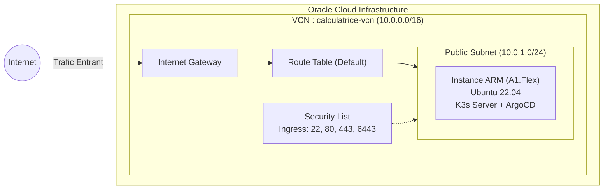
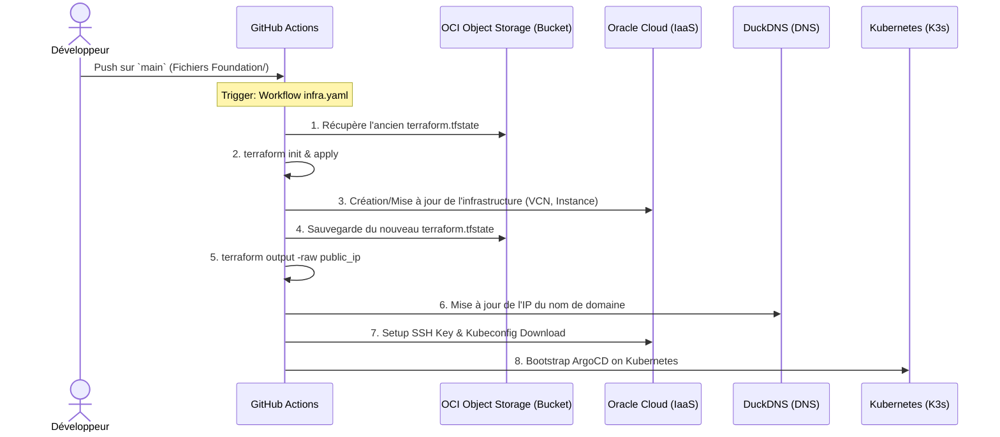

# Terraform - Oracle Cloud Infrastructure (OCI)
[](https://developer.hashicorp.com/terraform/docs)
[](https://registry.terraform.io/providers/oracle/oci/latest/docs)
[](https://docs.github.com/en/actions)

## Sommaire
- [Ressources Déployées](#ressources-déployées)
- [Prérequis](#prérequis)
- [Variables Utilisées (Inputs)](#variables-utilisées-inputs)
- [Sorties (Outputs)](#sorties-outputs)
- [Automatisation (CI/CD)](#automatisation-cicd)
- [Schéma Descriptif](#schéma-descriptif)
- [Résultat de terraform Plan](#résultat-de-terraform-plan)
- [Voir aussi](#voir-aussi)

## Ressources Déployées

- **Réseau Virtuel (VCN)** : Fournit le réseau cloud de base (`10.0.0.0/16`) sur OCI.
- **Internet Gateway & Route Table** : Permet l'accès à internet pour le sous-réseau.
- **Sous-Réseau Public (Subnet)** : Héberge l'instance de calcul (`10.0.1.0/24`).
- **Liste de Sécurité (Security List)** : Ouvre les ports 22 (SSH), 80 (HTTP challenge Let's Encrypt), 443 (HTTPS pour Cert-Manager) et 6443 (API K3s).
- **Instance de Calcul (Compute)** : Déploie une machine virtuelle ARM "Always Free" (VM.Standard.A1.Flex) avec 4 OCPU et 24 Go de RAM.
- **Provisionnement (Cloud-Init)** : Installe automatiquement K3s et ArgoCD au démarrage de l'instance, prépare l'environnement pour le déploiement de Cert-Manager, et configure le `kubeconfig` avec l'IP publique.

## Prérequis

Prérequis pour le déploiement :
- **Terraform** installé en local ou sur un runner CI.
- **Un compte Oracle Cloud (OCI)** avec les privilèges suffisants.
- **Une paire de clés (API Key)** générée depuis la console OCI pour l'authentification.
- **Une clé SSH** (`.pub` et `.pem`) générée localement pour se connecter à la future instance.

## Variables Utilisées (Inputs)

- `tenancy_ocid` : OCID de la location (Tenancy).
- `user_ocid` : OCID de l'utilisateur OCI exécutant le déploiement.
- `fingerprint` : Empreinte de la clé API pour l'authentification.
- `private_key_path` : Chemin local vers la clé privée `.pem`.
- `region` : Région de déploiement OCI (ex: `eu-paris-1`).
- `compartment_ocid` : OCID du compartiment accueillant les ressources.
- `ssh_public_key` : Clé publique SSH pour se connecter à l'instance (utilisateur `ubuntu`).

## Sorties (Outputs)

- `public_ip` : L'adresse IP publique assignée à la machine virtuelle OCI. Utilisée pour se connecter en SSH, configurer le fichier Kubeconfig, ou mettre à jour un enregistrement DNS dynamique (ex: DuckDNS).

## Schéma Descriptif

Voici un aperçu de l'architecture déployée sur Oracle Cloud :


```mermaid
graph LR
    Internet((Internet)) -->|Trafic Entrant| igw
    
    subgraph oci ["Oracle Cloud Infrastructure"]
        direction TB
        
        subgraph vcn ["VCN : calculatrice-vcn (10.0.0.0/16)"]
            igw["Internet Gateway"]
            rt["Route Table (Default)"]
            sl["Security List <br> Ingress: 22, 80, 443, 6443"]
            
            igw --> rt
            rt --> subnet
            
            subgraph subnet ["Public Subnet (10.0.1.0/24)"]
                vm["Instance ARM (A1.Flex) <br> Ubuntu 22.04 <br> K3s Server + ArgoCD"]
            end
            
            sl -.-> subnet
        end
    end
```

## Automatisation (CI/CD)

Le déploiement de cette infrastructure est entièrement automatisé via **GitHub Actions** (défini dans le fichier `.github/workflows/infra.yaml`).

Afin de préserver l'état de l'infrastructure entre deux exécutions, le fichier `terraform.tfstate` est stocké de manière distante et sécurisée dans un Bucket *Object Storage* sur OCI.

Voici le déroulement détaillé du pipeline :


```mermaid
sequenceDiagram
    actor Dev as Développeur
    participant GitHub as GitHub Actions
    participant OCI_Storage as OCI Object Storage (Bucket)
    participant OCI as Oracle Cloud (IaaS)
    participant DuckDNS as DuckDNS (DNS)
    participant K8s as Kubernetes (K3s)

    Dev->>GitHub: Push sur `main` (Fichiers Foundation/)
    note over GitHub: Trigger: Workflow infra.yaml
    GitHub->>OCI_Storage: 1. Récupère l'ancien terraform.tfstate
    GitHub->>GitHub: 2. terraform init & apply
    GitHub->>OCI: 3. Création/Mise à jour de l'infrastructure (VCN, Instance)
    GitHub->>OCI_Storage: 4. Sauvegarde du nouveau terraform.tfstate
    GitHub->>GitHub: 5. terraform output -raw public_ip
    GitHub->>DuckDNS: 6. Mise à jour de l'IP du nom de domaine
    GitHub->>OCI: 7. Setup SSH Key & Kubeconfig Download
    GitHub->>K8s: 8. Bootstrap ArgoCD on Kubernetes
```

## Résultat de terraform Plan

```hcl
Terraform used the selected providers to generate the following execution plan. Resource actions are indicated with the following symbols:
+ create

Terraform will perform the following actions:

# oci_core_default_route_table.route_table will be created
+ resource "oci_core_default_route_table" "route_table" {
+ compartment_id             = (known after apply)
+ defined_tags               = (known after apply)
+ display_name               = (known after apply)
+ freeform_tags              = (known after apply)
+ id                         = (known after apply)
+ manage_default_resource_id = (known after apply)
+ state                      = (known after apply)
+ time_created               = (known after apply)

+ route_rules {
+ cidr_block        = (known after apply)
+ description       = (known after apply)
+ destination       = "0.0.0.0/0"
+ destination_type  = "CIDR_BLOCK"
+ network_entity_id = (known after apply)
+ route_type        = (known after apply)
}
}

# oci_core_default_security_list.security_list will be created
+ resource "oci_core_default_security_list" "security_list" {
+ compartment_id             = (known after apply)
+ defined_tags               = (known after apply)
+ display_name               = (known after apply)
+ freeform_tags              = (known after apply)
+ id                         = (known after apply)
+ manage_default_resource_id = (known after apply)
+ state                      = (known after apply)
+ time_created               = (known after apply)

+ egress_security_rules {
+ description      = (known after apply)
+ destination      = "0.0.0.0/0"
+ destination_type = (known after apply)
+ protocol         = "all"
+ stateless        = (known after apply)
}

+ ingress_security_rules {
+ description = (known after apply)
+ protocol    = "6"
+ source      = "0.0.0.0/0"
+ source_type = (known after apply)
+ stateless   = false

+ tcp_options {
+ max = 22
+ min = 22
}
}
+ ingress_security_rules {
+ description = (known after apply)
+ protocol    = "6"
+ source      = "0.0.0.0/0"
+ source_type = (known after apply)
+ stateless   = false

+ tcp_options {
+ max = 443
+ min = 443
}
}
+ ingress_security_rules {
+ description = (known after apply)
+ protocol    = "6"
+ source      = "0.0.0.0/0"
+ source_type = (known after apply)
+ stateless   = false

+ tcp_options {
+ max = 6443
+ min = 6443
}
}
+ ingress_security_rules {
+ description = (known after apply)
+ protocol    = "6"
+ source      = "0.0.0.0/0"
+ source_type = (known after apply)
+ stateless   = false

+ tcp_options {
+ max = 80
+ min = 80
}
}
}

# oci_core_instance.arm_instance will be created
+ resource "oci_core_instance" "arm_instance" {
+ availability_domain                 = "yUJj:EU-PARIS-1-AD-1"
+ boot_volume_id                      = (known after apply)
+ capacity_reservation_id             = (known after apply)
+ compartment_id                      = "ocid1.tenancy.oc1..aaaaaaaajac7psa2g36ski3niulrqevpuwhog7z53zywfefqtyzo26erk44q"
+ compute_cluster_id                  = (known after apply)
+ dedicated_vm_host_id                = (known after apply)
+ defined_tags                        = (known after apply)
+ display_name                        = "calculatrice-k3s-server"
+ extended_metadata                   = (known after apply)
+ fault_domain                        = (known after apply)
+ freeform_tags                       = (known after apply)
+ hostname_label                      = (known after apply)
+ id                                  = (known after apply)
+ image                               = (known after apply)
+ instance_configuration_id           = (known after apply)
+ ipxe_script                         = (known after apply)
+ is_cross_numa_node                  = (known after apply)
+ is_pv_encryption_in_transit_enabled = (known after apply)
+ launch_mode                         = (known after apply)
+ metadata                            = {
+ "ssh_authorized_keys" = "ssh-rsa AAAAB3NzaC1yc2EAAAADAQABAAACAQDUFZyn36y7mNlwUr9MW+bApkgqUUEL2ZV+fNVVNvbNHrT2V2DtG3f6PrWloclIhGjgvp/p8vKmxNYKuJr8nu0NeEGn3ZzdP1I7vMEbPguQFfRjpDsR6dCM6l0oq0H0vgYHDl64TnV10RGBVasM+eamJsocHKIOfmfWOMGjj3sBNmacbEvxSqFG68Ixy5rVG8P/kn9cklWDJfCekV5MYzBAIa1QTVKAtt6+gLRGWKkLp9Y5/CO4b9LebVqYHDxo9I2B/SAPHY3KNpObAaELuexpSM8DsRSNvW7KdIQmMnPIXAuPAslIr/5AoNbxXtYKfn89K4mduGgVLr9eoLG9vMlycvOI9aOyVi/eKwiFnlVm4h3Xjq6n1U2cSG6h1+6+Cseuc5W2LL6Gc1JLmImSuzIRduF3i2jONJ6CxmNoEvKe0A59u5CJ/obbcSELvzc/6Bw2e2zc+qEzsBdOnoa6H0ZvZPPnR4aqnF6Sn8scg12cWnJ5CmLjMTZnJILai6F/k3pIJeSJkQlsSEQbVSS3fqmBAJeOjchQylMR4pPYWNtAdwFDcBr6Fe5CAsJ9g6L9C0dzV0sujoAB9Xbi0HvssZx3FlHfeiv4iovJkT3ajTlfIdqOcrP3IOekd2g3CmVnrt6pYGYfyKiJusC4hHiR4whj0cV0ykrnUw4EcgB/S5bjZw== linux@NOT"
+ "user_data"           = "IyEvYmluL2Jhc2gNCg0KIyAxLiBPdXZlcnR1cmUgZGVzIHBvcnRzIGRhbnMgbGUgcGFyZS1mZXUgaW50ZXJuZSBVYnVudHUgKGlwdGFibGVzKQ0KaXB0YWJsZXMgLUkgSU5QVVQgLXAgdGNwIC1tIHN0YXRlIC0tc3RhdGUgTkVXIC0tZHBvcnQgODAgLWogQUNDRVBUDQppcHRhYmxlcyAtSSBJTlBVVCAtcCB0Y3AgLW0gc3RhdGUgLS1zdGF0ZSBORVcgLS1kcG9ydCA0NDMgLWogQUNDRVBUDQppcHRhYmxlcyAtSSBJTlBVVCAtcCB0Y3AgLW0gc3RhdGUgLS1zdGF0ZSBORVcgLS1kcG9ydCA2NDQzIC1qIEFDQ0VQVA0KbmV0ZmlsdGVyLXBlcnNpc3RlbnQgc2F2ZQ0KDQojIDIuIEluc3RhbGxhdGlvbiBkZSBLM3MgYXZlYyBwcmlzZSBlbiBjaGFyZ2UgZGUgbCdJUCBwdWJsaXF1ZSBwb3VyIGxlIGNlcnRpZmljYXQgU1NMDQpQVUJMSUNfSVA9JChjdXJsIC1zIGlmY29uZmlnLm1lKQ0KY3VybCAtc2ZMIGh0dHBzOi8vZ2V0Lmszcy5pbyB8IElOU1RBTExfSzNTX0VYRUM9InNlcnZlciAtLXRscy1zYW4gJFBVQkxJQ19JUCIgc2ggLXMgLQ0KDQojIDMuIFByw6lwYXJhdGlvbiBhdXRvbWF0aXF1ZSBkdSBmaWNoaWVyIEt1YmVjb25maWcNCm1rZGlyIC1wIC9ob21lL3VidW50dS8ua3ViZQ0KY3AgL2V0Yy9yYW5jaGVyL2szcy9rM3MueWFtbCAvaG9tZS91YnVudHUvLmt1YmUvY29uZmlnDQpjaG93biB1YnVudHU6dWJ1bnR1IC9ob21lL3VidW50dS8ua3ViZS9jb25maWcNCg0KIyBSZW1wbGFjZW1lbnQgYXV0b21hdGlxdWUgZGUgbCdJUCBsb2NhbGUgcGFyIGwnSVAgcHVibGlxdWUgcG91ciBHaXRIdWIgQWN0aW9ucw0Kc2VkIC1pICJzLzEyNy4wLjAuMS8kUFVCTElDX0lQL2ciIC9ob21lL3VidW50dS8ua3ViZS9jb25maWcNCg0KIyA0LiBJbnN0YWxsYXRpb24gZGUgQXJnb0NEIChHaXRPcHMpDQpleHBvcnQgS1VCRUNPTkZJRz0vZXRjL3JhbmNoZXIvazNzL2szcy55YW1sDQprdWJlY3RsIGNyZWF0ZSBuYW1lc3BhY2UgYXJnb2NkDQprdWJlY3RsIGFwcGx5IC1uIGFyZ29jZCAtZiBodHRwczovL3Jhdy5naXRodWJ1c2VyY29udGVudC5jb20vYXJnb3Byb2ovYXJnby1jZC9zdGFibGUvbWFuaWZlc3RzL2luc3RhbGwueWFtbA0K"
}
+ private_ip                          = (known after apply)
+ public_ip                           = (known after apply)
+ region                              = (known after apply)
+ shape                               = "VM.Standard.A1.Flex"
+ state                               = (known after apply)
+ subnet_id                           = (known after apply)
+ system_tags                         = (known after apply)
+ time_created                        = (known after apply)
+ time_maintenance_reboot_due         = (known after apply)

+ agent_config (known after apply)

+ availability_config (known after apply)

+ create_vnic_details {
+ assign_ipv6ip          = (known after apply)
+ assign_public_ip       = "true"
+ defined_tags           = (known after apply)
+ display_name           = (known after apply)
+ freeform_tags          = (known after apply)
+ hostname_label         = (known after apply)
+ nsg_ids                = (known after apply)
+ private_ip             = (known after apply)
+ skip_source_dest_check = (known after apply)
+ subnet_id              = (known after apply)
+ vlan_id                = (known after apply)

+ ipv6address_ipv6subnet_cidr_pair_details (known after apply)
}

+ instance_options (known after apply)

+ launch_options (known after apply)

+ launch_volume_attachments (known after apply)

+ platform_config (known after apply)

+ preemptible_instance_config (known after apply)

+ shape_config {
+ baseline_ocpu_utilization     = (known after apply)
+ gpu_description               = (known after apply)
+ gpus                          = (known after apply)
+ local_disk_description        = (known after apply)
+ local_disks                   = (known after apply)
+ local_disks_total_size_in_gbs = (known after apply)
+ max_vnic_attachments          = (known after apply)
+ memory_in_gbs                 = 24
+ networking_bandwidth_in_gbps  = (known after apply)
+ nvmes                         = (known after apply)
+ ocpus                         = 4
+ processor_description         = (known after apply)
+ vcpus                         = (known after apply)
}

+ source_details {
+ boot_volume_size_in_gbs = (known after apply)
+ boot_volume_vpus_per_gb = (known after apply)
+ source_id               = "ocid1.image.oc1.eu-paris-1.aaaaaaaaf7lwv3x6btemjwaalowhvkizoappw6fpahplwacqueffvwzyimna"
+ source_type             = "image"

+ instance_source_image_filter_details (known after apply)
}
}

# oci_core_internet_gateway.igw will be created
+ resource "oci_core_internet_gateway" "igw" {
+ compartment_id = "ocid1.tenancy.oc1..aaaaaaaajac7psa2g36ski3niulrqevpuwhog7z53zywfefqtyzo26erk44q"
+ defined_tags   = (known after apply)
+ display_name   = (known after apply)
+ enabled        = true
+ freeform_tags  = (known after apply)
+ id             = (known after apply)
+ route_table_id = (known after apply)
+ state          = (known after apply)
+ time_created   = (known after apply)
+ vcn_id         = (known after apply)
}

# oci_core_subnet.subnet will be created
+ resource "oci_core_subnet" "subnet" {
+ availability_domain        = (known after apply)
+ cidr_block                 = "10.0.1.0/24"
+ compartment_id             = "ocid1.tenancy.oc1..aaaaaaaajac7psa2g36ski3niulrqevpuwhog7z53zywfefqtyzo26erk44q"
+ defined_tags               = (known after apply)
+ dhcp_options_id            = (known after apply)
+ display_name               = (known after apply)
+ dns_label                  = (known after apply)
+ freeform_tags              = (known after apply)
+ id                         = (known after apply)
+ ipv6cidr_block             = (known after apply)
+ ipv6cidr_blocks            = (known after apply)
+ ipv6virtual_router_ip      = (known after apply)
+ prohibit_internet_ingress  = (known after apply)
+ prohibit_public_ip_on_vnic = (known after apply)
+ route_table_id             = (known after apply)
+ security_list_ids          = (known after apply)
+ state                      = (known after apply)
+ subnet_domain_name         = (known after apply)
+ time_created               = (known after apply)
+ vcn_id                     = (known after apply)
+ virtual_router_ip          = (known after apply)
+ virtual_router_mac         = (known after apply)
}

# oci_core_vcn.vcn will be created
+ resource "oci_core_vcn" "vcn" {
+ byoipv6cidr_blocks               = (known after apply)
+ cidr_block                       = "10.0.0.0/16"
+ cidr_blocks                      = (known after apply)
+ compartment_id                   = "ocid1.tenancy.oc1..aaaaaaaajac7psa2g36ski3niulrqevpuwhog7z53zywfefqtyzo26erk44q"
+ default_dhcp_options_id          = (known after apply)
+ default_route_table_id           = (known after apply)
+ default_security_list_id         = (known after apply)
+ defined_tags                     = (known after apply)
+ display_name                     = "calculatrice-vcn"
+ dns_label                        = (known after apply)
+ freeform_tags                    = (known after apply)
+ id                               = (known after apply)
+ ipv6cidr_blocks                  = (known after apply)
+ ipv6private_cidr_blocks          = (known after apply)
+ is_ipv6enabled                   = (known after apply)
+ is_oracle_gua_allocation_enabled = (known after apply)
+ state                            = (known after apply)
+ time_created                     = (known after apply)
+ vcn_domain_name                  = (known after apply)

+ byoipv6cidr_details (known after apply)
}

Plan: 6 to add, 0 to change, 0 to destroy.

Changes to Outputs:
~ public_ip = "89.168.55.81" -> (known after apply)
```

## Voir aussi
- [`Application/`](../Application) : Fichiers de l'application web (front-end, back-end, consumer), Dockerfiles associés et docker-compose.
- [`Helm/`](../Helm) : Le chart Helm qui est surveillé et déployé par ArgoCD.
- [`ArgoCD/`](../ArgoCD) : Configuration ArgoCD pour la synchronisation du cluster (déploiement continu).
- [`.github/workflows/`](../.github/workflows) : Fichier GitHub Actions pour automatiser le provisionnement de l'infrastructure et le déploiement de l'application.
- [`Kubernetes/`](../Kubernetes) : Manifests Kubernetes bruts (historique).
- [`Terragrunt/`](../Terragrunt) : Configuration Terragrunt pour gérer plusieurs environnements (Dev, Preprod, Prod).
- [`Sujet.md`](../Sujet.md) ou [source](https://github.com/JeromeMSD/module_virtualisation-et-cloud-computing/blob/main/projet.md).
- [🏠 Retourner à la racine du projet](../README.md)


- [🔼 Back to Top](#terraform---oracle-cloud-infrastructure-oci)