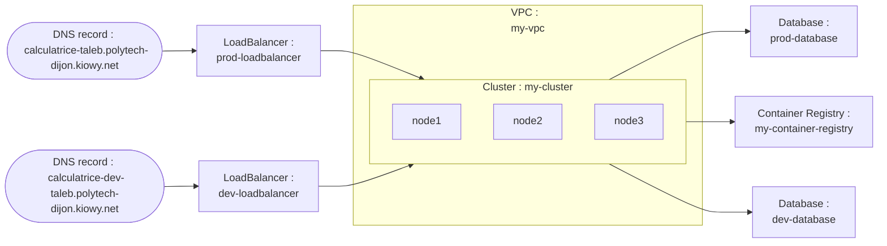

# Foundation - Terraform - Scaleway
[](https://developer.hashicorp.com/terraform/docs)
[](https://registry.terraform.io/providers/scaleway/scaleway/latest/docs)

## Sommaire
- [Ressources Déployées](#ressources-déployées)
- [Variables Utilisées](#variables-utilisées)
- [Schéma Descriptif](#schéma-descriptif)
- [Résultat de terraform Plan](#résultat-de-terraform-plan)
- [Voir aussi](#voir-aussi)

## Ressources Déployées

- **Réseau privé virtuel (VPC)** : Fournit un réseau privé pour les ressources cloud.
- **Cluster Kubernetes** : Gère les conteneurs de l'application.
- **Container Registry** : Stocke les images Docker nécessaires pour le déploiement de l'application.
- **Base de Données (Redis)** : Déployée en environnement `dev` et `prod` pour le stockage.
- **Load Balancer** : Assure la répartition du trafic pour chaque environnement (`dev` et `prod`).
- **DNS** : Crée des enregistrements DNS pour l'accès à l'application en fonction de l'environnement.

## Variables Utilisées

- `project_id` : Identifiant du projet.
- `zone` et `region` : Zone et région pour le déploiement (`fr-par`).
- `environments` : Environnement de déploiement (`dev` ou `prod`).
- `student` : Nom de l'étudiant utilisé pour les noms DNS.

## Schéma Descriptif

Voici un aperçu de l'architecture déployée :



## Résultat de terraform Plan

```hcl
Terraform used the selected providers to generate the following execution plan. Resource actions are indicated with the following symbols:
  + create

Terraform will perform the following actions:

  # scaleway_domain_record.dns_record["dev"] will be created
  + resource "scaleway_domain_record" "dns_record" {
      + data            = (known after apply)
      + dns_zone        = "polytech-dijon.kiowy.net"
      + fqdn            = (known after apply)
      + id              = (known after apply)
      + keep_empty_zone = false
      + name            = "calculatrice-dev-taleb-polytech-dijon.kiowy.net"
      + priority        = (known after apply)
      + project_id      = (known after apply)
      + root_zone       = (known after apply)
      + ttl             = 3600
      + type            = "A"
    }

  # scaleway_domain_record.dns_record["prod"] will be created
  + resource "scaleway_domain_record" "dns_record" {
      + data            = (known after apply)
      + dns_zone        = "polytech-dijon.kiowy.net"
      + fqdn            = (known after apply)
      + id              = (known after apply)
      + keep_empty_zone = false
      + name            = "calculatrice-taleb-polytech-dijon.kiowy.net"
      + priority        = (known after apply)
      + project_id      = (known after apply)
      + root_zone       = (known after apply)
      + ttl             = 3600
      + type            = "A"
    }

  # scaleway_k8s_cluster.cluster will be created
  + resource "scaleway_k8s_cluster" "cluster" {
      + apiserver_url               = (known after apply)
      + cni                         = "cilium"
      + created_at                  = (known after apply)
      + delete_additional_resources = false
      + id                          = (known after apply)
      + kubeconfig                  = (sensitive value)
      + name                        = "my-cluster"
      + organization_id             = (known after apply)
      + private_network_id          = (known after apply)
      + project_id                  = (known after apply)
      + region                      = "fr-par"
      + status                      = (known after apply)
      + type                        = (known after apply)
      + updated_at                  = (known after apply)
      + upgrade_available           = (known after apply)
      + version                     = "1.21.4"
      + wildcard_dns                = (known after apply)

      + auto_upgrade (known after apply)

      + autoscaler_config (known after apply)

      + open_id_connect_config (known after apply)
    }

  # scaleway_lb.loadbalancer["dev"] will be created
  + resource "scaleway_lb" "loadbalancer" {
      + id                      = (known after apply)
      + ip_address              = (known after apply)
      + ip_id                   = (known after apply)
      + ip_ids                  = (known after apply)
      + ipv6_address            = (known after apply)
      + name                    = "dev-loadbalancer"
      + organization_id         = (known after apply)
      + project_id              = (known after apply)
      + region                  = (known after apply)
      + ssl_compatibility_level = "ssl_compatibility_level_intermediate"
      + type                    = "lb-s"
      + zone                    = (known after apply)
    }

  # scaleway_lb.loadbalancer["prod"] will be created
  + resource "scaleway_lb" "loadbalancer" {
      + id                      = (known after apply)
      + ip_address              = (known after apply)
      + ip_id                   = (known after apply)
      + ip_ids                  = (known after apply)
      + ipv6_address            = (known after apply)
      + name                    = "prod-loadbalancer"
      + organization_id         = (known after apply)
      + project_id              = (known after apply)
      + region                  = (known after apply)
      + ssl_compatibility_level = "ssl_compatibility_level_intermediate"
      + type                    = "lb-s"
      + zone                    = (known after apply)
    }

  # scaleway_lb_ip.loadbalancer_ip["dev"] will be created
  + resource "scaleway_lb_ip" "loadbalancer_ip" {
      + id              = (known after apply)
      + ip_address      = (known after apply)
      + is_ipv6         = false
      + lb_id           = (known after apply)
      + organization_id = (known after apply)
      + project_id      = (known after apply)
      + region          = (known after apply)
      + reverse         = (known after apply)
      + zone            = (known after apply)
    }

  # scaleway_lb_ip.loadbalancer_ip["prod"] will be created
  + resource "scaleway_lb_ip" "loadbalancer_ip" {
      + id              = (known after apply)
      + ip_address      = (known after apply)
      + is_ipv6         = false
      + lb_id           = (known after apply)
      + organization_id = (known after apply)
      + project_id      = (known after apply)
      + region          = (known after apply)
      + reverse         = (known after apply)
      + zone            = (known after apply)
    }

  # scaleway_rdb_instance.database["dev"] will be created
  + resource "scaleway_rdb_instance" "database" {
      + backup_same_region        = (known after apply)
      + backup_schedule_frequency = (known after apply)
      + backup_schedule_retention = (known after apply)
      + certificate               = (known after apply)
      + disable_backup            = false
      + endpoint_ip               = (known after apply)
      + endpoint_port             = (known after apply)
      + engine                    = "Redis"
      + id                        = (known after apply)
      + is_ha_cluster             = false
      + name                      = "dev-database"
      + node_type                 = "DEV1-S"
      + organization_id           = (known after apply)
      + project_id                = (known after apply)
      + read_replicas             = (known after apply)
      + region                    = "fr-par"
      + settings                  = (known after apply)
      + user_name                 = (known after apply)
      + volume_size_in_gb         = (known after apply)
      + volume_type               = "lssd"

      + load_balancer (known after apply)

      + logs_policy (known after apply)
    }

  # scaleway_rdb_instance.database["prod"] will be created
  + resource "scaleway_rdb_instance" "database" {
      + backup_same_region        = (known after apply)
      + backup_schedule_frequency = (known after apply)
      + backup_schedule_retention = (known after apply)
      + certificate               = (known after apply)
      + disable_backup            = false
      + endpoint_ip               = (known after apply)
      + endpoint_port             = (known after apply)
      + engine                    = "Redis"
      + id                        = (known after apply)
      + is_ha_cluster             = false
      + name                      = "prod-database"
      + node_type                 = "DEV1-S"
      + organization_id           = (known after apply)
      + project_id                = (known after apply)
      + read_replicas             = (known after apply)
      + region                    = "fr-par"
      + settings                  = (known after apply)
      + user_name                 = (known after apply)
      + volume_size_in_gb         = (known after apply)
      + volume_type               = "lssd"

      + load_balancer (known after apply)

      + logs_policy (known after apply)
    }

  # scaleway_registry_namespace.container_registry will be created
  + resource "scaleway_registry_namespace" "container_registry" {
      + endpoint        = (known after apply)
      + id              = (known after apply)
      + name            = "my-container-registry"
      + organization_id = (known after apply)
      + project_id      = (known after apply)
      + region          = "fr-par"
    }

  # scaleway_vpc_private_network.vpc will be created
  + resource "scaleway_vpc_private_network" "vpc" {
      + created_at      = (known after apply)
      + id              = (known after apply)
      + is_regional     = (known after apply)
      + name            = "my-vpc"
      + organization_id = (known after apply)
      + project_id      = (known after apply)
      + region          = "fr-par"
      + updated_at      = (known after apply)
      + vpc_id          = (known after apply)
      + zone            = (known after apply)

      + ipv4_subnet (known after apply)

      + ipv6_subnets (known after apply)
    }

Plan: 11 to add, 0 to change, 0 to destroy.
```
## Voir aussi
- [`Application/`](../Application) : Fichiers de l'application web (front-end, back-end, consumer), Dockerfiles associés et docker-compose.
- [`Kubernetes/`](../Kubernetes) : Manifests Kubernetes (Replicaset, Service, Ingress).
- [`Projet.md`](../README.md) : Description du projet.
- [`Sujet.md`](../Sujet.md) ou [source](https://github.com/JeromeMSD/module_virtualisation-et-cloud-computing/blob/main/projet.md).
- [🔼 Back to Top](#foundation---terraform---scaleway)
