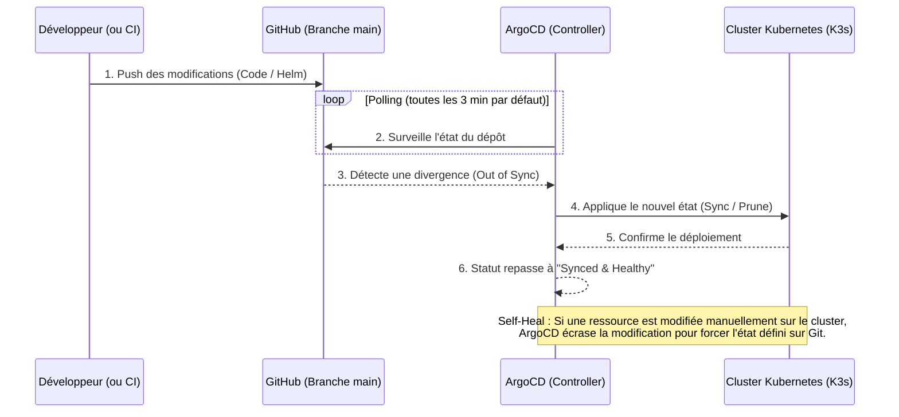

# GitOps & ArgoCD
[](https://argo-cd.readthedocs.io/en/stable/)
[](https://www.gitops.tech/)
[](https://docs.github.com/en/actions)
[](https://registry.terraform.io/providers/oracle/oci/latest/docs)

## Sommaire
- [Introduction](#introduction)
- [Schéma de Fonctionnement](#schéma-de-fonctionnement)
- [Configuration de l'Application](#configuration-de-lapplication)
- [Déploiement](#déploiement)
- [Voir aussi](#voir-aussi)

## Introduction

La philosophie **GitOps** consiste à utiliser un dépôt Git comme unique source de vérité pour les configurations d'infrastructure et d'applications. 

Dans ce projet, nous utilisons **ArgoCD** (qui a d'ailleurs été installé automatiquement sur notre cluster K3s par le script cloud-init de Terraform). ArgoCD surveille en permanence notre dépôt GitHub et s'assure que l'état du cluster Kubernetes correspond exactement à ce qui est défini dans notre code.

## Schéma de Fonctionnement

Voici comment s'articule le flux de déploiement continu (CD) avec ArgoCD :



## Configuration de l'Application

Ce dossier contient le fichier `argocd-app.yaml`. Il s'agit d'un manifeste Kubernetes de type `Application` (une Custom Resource spécifique à ArgoCD) qui donne les instructions suivantes :

1. **La Source :** "Surveille le dépôt `virtualisation-et-cloud-computing.git` sur la branche `main`, et cible plus précisément le dossier `Helm/calculatrice`".
2. **La Destination :** "Déploie ce chart Helm localement sur le cluster en cours d'exécution (`https://kubernetes.default.svc`) dans le namespace `taleb`".
3. **La Synchronisation (SyncPolicy) :**
   - **Automated / SelfHeal :** Si quelqu'un modifie manuellement une ressource sur le cluster (ex: modification sauvage avec `kubectl`), ArgoCD écrasera sa modification pour restaurer la version définie sur Git.
   - **Prune :** Si on supprime un fichier ou un déploiement dans le dépôt Git, ArgoCD le supprimera du cluster.
   - **CreateNamespace :** Créera automatiquement le namespace `taleb` s'il n'existe pas encore.

En résumé, grâce à ce fichier, **toute modification poussée (Push) sur la branche `main` dans le dossier `Helm` est détectée et déployée automatiquement**, sans aucune intervention humaine !

## Déploiement

Pour activer l'automatisation GitOps, il suffit d'appliquer ce manifeste une seule fois sur le cluster Kubernetes (dans le namespace où ArgoCD a été installé) :

```shell
kubectl apply -f argocd-app.yaml -n argocd
```

Une fois cette commande exécutée, ArgoCD prend le relais, synchronise le Chart Helm et maintient l'infrastructure à jour !

## Voir aussi
- [`Foundation/`](../Foundation) : Terraform (provisionnement de l'infrastructure).
- [`Application/`](../Application) : Fichiers de l'application web (front-end, back-end, consumer), Dockerfiles associés et docker-compose.
- [`Helm/`](../Helm) : Le chart Helm qui est surveillé et déployé par ArgoCD.
- [`.github/workflows/`](../.github/workflows) : Fichier GitHub Actions pour automatiser le provisionnement de l'infrastructure et le déploiement de l'application.
- [`Kubernetes/`](../Kubernetes) : Manifests Kubernetes bruts (historique).
- [`Terragrunt/`](../Terragrunt) : Configuration Terragrunt pour gérer plusieurs environnements (Dev, Preprod, Prod).
- [`Sujet.md`](../Sujet.md) ou [source](https://github.com/JeromeMSD/module_virtualisation-et-cloud-computing/blob/main/projet.md).
- [🏠 Retourner à la racine du projet](../README.md)


- [🔼 Back to Top](#gitops--argocd)