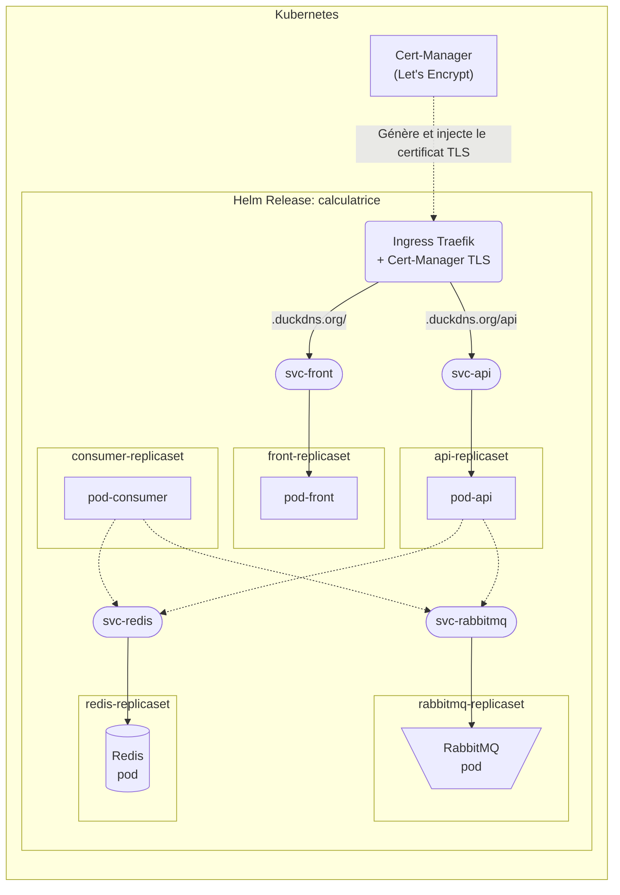
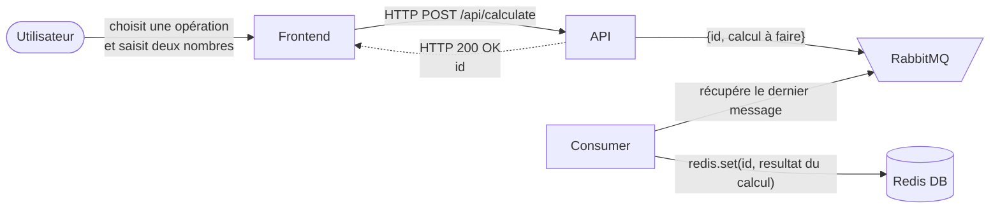
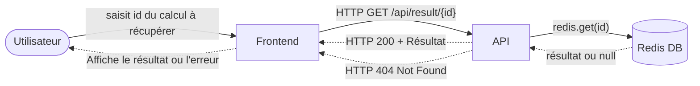
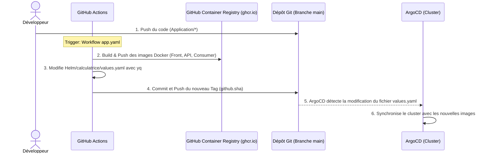

# Helm
[](https://helm.sh/docs/)
[](https://kubernetes.io/docs/home/)
[](https://docs.github.com/en/actions)
[](https://registry.terraform.io/providers/oracle/oci/latest/docs)

## Sommaire

- [Schema récapitulatif (services et replicasets)](#schema-récapitulatif-services-et-replicasets)
- [Fonctionnement](#fonctionnement)
    - [Etape 1 : Demande de calcul](#etape-1--demande-de-calcul)
    - [Etape 2 : Récupération du résultat du calcul](#etape-2--récupération-du-résultat-du-calcul)
- [Automatisation du déploiement (CI / GitOps)](#automatisation-du-déploiement-ci--gitops)
- [Commandes utiles](#commandes-utiles)
- [Voir aussi](#voir-aussi)

## Schema récapitulatif (services et replicasets)


## Fonctionnement
### Etape 1 : Demande de calcul



### Etape 2 : Récupération du résultat du calcul



## Automatisation du déploiement (CI / GitOps)

> [!NOTE]
> Le cycle de vie de l'application est automatisé via GitHub Actions (fichier [`.github/workflows/app.yaml`](../.github/workflows/app.yaml)).

Dans notre architecture, nous utilisons l'approche **GitOps** avec ArgoCD. Cela signifie que le pipeline CI/CD n'exécute **pas** directement de commande sur le cluster (pas de `helm upgrade`). Son rôle s'arrête à la mise à jour du dépôt Git (la source de vérité).

Voici le déroulement complet du pipeline applicatif :



Le fait d'avoir un chart Helm simplifie considérablement la tâche du pipeline : au lieu de devoir modifier des tags dans plusieurs fichiers YAML disparates, le pipeline utilise simplement l'utilitaire `yq` pour mettre à jour la valeur `image.tag` à un seul endroit (`values.yaml`), puis fait un `git commit`. L'orchestration du déploiement est ensuite déléguée à ArgoCD.

## Commandes utiles

Toutes les anciennes commandes `kubectl apply -f` ont été remplacées par la gestion centralisée de Helm.

#### Installation et Mise à jour du Chart

Pour installer ou mettre à jour l'application (Release nommée `calculatrice`) :
```shell
helm upgrade --install calculatrice ./calculatrice --namespace <namespace> --create-namespace
```

#### Vérification du déploiement

Lister les déploiements Helm actifs :
```shell
helm list -n <namespace>
```

Voir l'historique des versions déployées (utile pour le CI/CD) :
```shell
helm history calculatrice -n <namespace>
```

#### Debugging & Rollback

Pour simuler un déploiement et voir les fichiers YAML finaux qui seront générés (sans rien modifier sur le cluster) :
```shell
helm upgrade --install calculatrice ./calculatrice --dry-run --debug -n <namespace>
```

Pour revenir à une version précédente (par exemple la révision 1) :
```shell
helm rollback calculatrice 1 -n <namespace>
```

#### Désinstallation

Pour supprimer entièrement l'application et toutes ses ressources associées (pods, services, ingress) d'un seul coup :
```shell
helm uninstall calculatrice -n <namespace>
```

## Voir aussi
- [`Foundation/`](../Foundation) : Terraform (provisionnement de l'infrastructure).
- [`Application/`](../Application) : Fichiers de l'application web (front-end, back-end, consumer), Dockerfiles associés et docker-compose.
- [`GitOps/`](../GitOps) : Configuration ArgoCD pour la synchronisation du cluster (déploiement continu).
- [`.github/workflows/`](../.github/workflows) : Fichier GitHub Actions pour automatiser le provisionnement de l'infrastructure et le déploiement de l'application.
- [`Kubernetes/`](../Kubernetes) : Manifests Kubernetes bruts (historique).
- [`Terragrunt/`](../Terragrunt) : Configuration Terragrunt pour gérer plusieurs environnements (Dev, Preprod, Prod).
- [`Sujet.md`](../Sujet.md) ou [source](https://github.com/JeromeMSD/module_virtualisation-et-cloud-computing/blob/main/projet.md).
- [🏠 Retourner à la racine du projet](../README.md)


- [🔼 Back to Top](#helm)