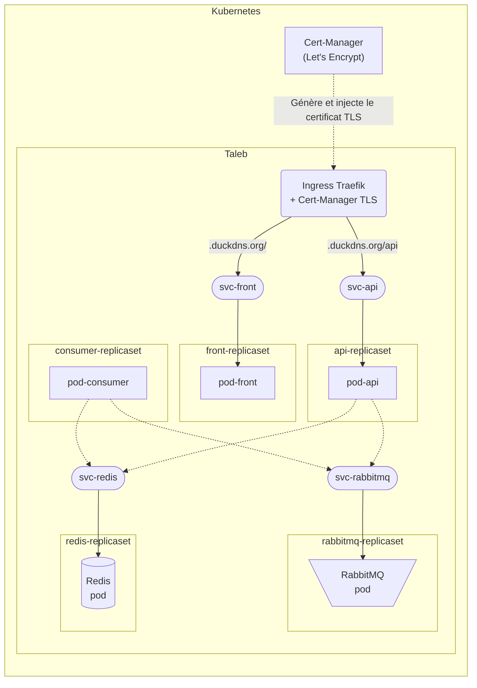
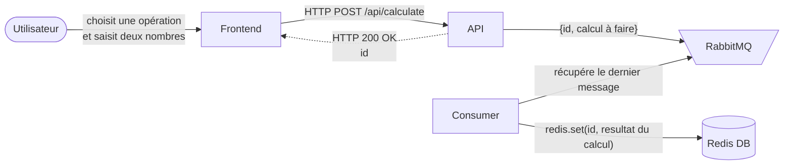
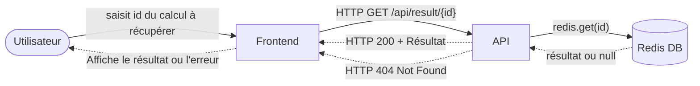

# Kubernetes
[](https://kubernetes.io/docs/home/)
[](https://docs.github.com/en/actions)
[](https://registry.terraform.io/providers/oracle/oci/latest/docs)

> [!WARNING]
> **Historique / Déprécié :** Ce dossier contient les manifestes Kubernetes bruts (fichiers YAML individuels). Cette méthode manuelle n'est plus utilisée activement dans le cycle de vie du projet. Elle a été entièrement remplacée par le Chart **[Helm](../Helm)**, qui est lui-même déployé automatiquement via **[ArgoCD](../GitOps)**. 
> Ces fichiers sont conservés ici uniquement à des fins d'historique et de pédagogie.

## Sommaire

- [Schema récapitulatif (services et replicasets)](#schema-récapitulatif-services-et-replicasets)
- [Fonctionnement](#fonctionnement)
    - [Etape 1 : Demande de calcul](#etape-1--demande-de-calcul)
    - [Etape 2 : Récupération du résultat du calcul](#etape-2--récupération-du-résultat-du-calcul)
- [Difficultés rencontrées](#difficultés-rencontrées)
- [Automatisation du déploiement](#automatisation-du-déploiement)
- [Commandes utiles](#commandes-utiles)
    - [Autres commandes utiles](#autres-commandes-utiles)
- [Voir aussi](#voir-aussi)

## Schema récapitulatif (services et replicasets)


```mermaid
graph LR
    
    subgraph "Kubernetes"
        subgraph "Taleb"
            subgraph "front-replicaset"
                pod-front
            end
            
            subgraph "api-replicaset"
                pod-api
            end
            
            subgraph "redis-replicaset"
                pod-redis[("Redis <br> pod")]
            end
            
            subgraph "rabbitmq-replicaset"
                pod-rabbitmq[\" RabbitMQ <br> pod"/]
            end
            
            subgraph "consumer-replicaset"
                pod-consumer
            end
            
            svc-api([svc-api]) --> pod-api
            svc-redis([svc-redis]) --> pod-redis
            svc-rabbitmq([svc-rabbitmq]) --> pod-rabbitmq
            pod-consumer -.-> svc-rabbitmq
            pod-consumer -.-> svc-redis
            pod-api -.-> svc-redis
            pod-api -.-> svc-rabbitmq
            ing -->|"<domaine>.duckdns.org/api"| svc-api
            ing(Ingress Traefik <br> + Cert-Manager TLS) -->|"<domaine>.duckdns.org/"| svc-front
            svc-front([svc-front]) --> pod-front
        end
        CertManager["Cert-Manager <br> (Let's Encrypt)"] -.->|"Génère et injecte le certificat TLS"| ing
    end
```
## Fonctionnement
### Etape 1 : Demande de calcul


```mermaid
graph LR
    user([Utilisateur]) -->|choisit une opération <br> et saisit deux nombres| F[Frontend]
    F -->|"HTTP POST /api/calculate"| A[API]
    A -->|"{id, calcul à faire}"| Q[\ RabbitMQ /]
    A -.->|HTTP 200 OK <br> id| F
    C[Consumer] -->|"récupére le dernier message"| Q[\ RabbitMQ /]
    C -->|"redis.set(id, resultat du calcul)"| R[(Redis DB)]
```

### Etape 2 : Récupération du résultat du calcul


```mermaid
graph LR
    user([Utilisateur]) -->|saisit id du calcul à récupérer| F[Frontend]
    F -->|"HTTP GET /api/result/{id}"| A[API]
    A -->|"redis.get(id)"| R[(Redis DB)]
    R -.->|"résultat ou null"| A
    A -.->|HTTP 200 + Résultat| F
    A -.->|HTTP 404 Not Found| F
    F -.->|Affiche le résultat ou l'erreur| user
```

## Difficultés rencontrées

### Kubernetes services :
- Remplacer `host.docker.internal` et `localhost`  par les services Kubernetes appropriés `svc-api`, `svc-rabbitmq`, et `svc-redis`.
```python
redis = Redis(host='svc-redis', port=6379, db=0)
connection = pika.BlockingConnection(pika.ConnectionParameters(host='svc-rabbitmq'))
```
```javascript
const response = await fetch(`http://svc-api:5000/api/calculate`, {
    // ...
});
const response = await fetch(`http://svc-api:5000/api/result/${operationId}`, {
    // ...
});

```
- Postman utilisé pour tester les requêtes API.

### Accès à l'application depuis l'extérieur :

- Problème de communication entre le Frontend et le Backend.
- **Solution :** Utilisation de l'Ingress Traefik pour rediriger les requêtes arrivant sur l'URL du Frontend quand le chemin est "/api" vers le service API. Plus de details [ici](../docs/Autre/Modification.md).
```javascript
const response = await fetch(`http://<domaine>.duckdns.org/api/calculate`, {
    // ...
});
const response = await fetch(`http://<domaine>.duckdns.org/api/result/${operationId}`, {
    // ...
});
```

## Automatisation du déploiement

> [!NOTE]
> ~~Le déploiement de l'application est automotisé à l'aide de GitHub Actions. Plus de détails [workflow](../.github/workflows/build_push_deploy.yaml).~~  
> Cette partie n'est plus conservée. Voir le déploiement automatisé via **[Helm](../Helm)**, **[ArgoCD](../GitOps)** et **[GitHub Actions](../.github/workflows/app.yaml)**.

## Commandes utiles

#### Namespace Kubernetes

```shell
kubectl create ns <name_for_namespace>
```
```shell
kubectl config set-context --current --namespace=<namespace>
```

#### Déploiement Redis

```shell
kubectl apply -f redis-replicaset.yaml
```
```shell
kubectl apply -f redis-service.yaml
```

#### Déploiement RabbitMQ

```shell
kubectl apply -f rabbitmq-replicaset.yaml
```
```shell
kubectl apply -f rabbitmq-service.yaml
```

#### Déploiement Frontend

```shell
kubectl apply -f front-replicaset.yaml
```
```shell
kubectl apply -f front-service.yaml
```

#### Déploiement Ingress

```shell
kubectl apply -f traefik-ingress.yaml
```

#### Déploiement Backend API

```shell
kubectl apply -f api-replicaset.yaml
```
```shell
kubectl apply -f api-service.yaml
```

#### Déploiement Consumer
```shell
kubectl apply -f consumer-replicaset.yaml
```

#### Debugging
```shell
kubectl get pods
```
```shell
kubectl get replicasets
```
```shell
kubectl get svc
```
```shell
kubectl get ingress
```
```shell
kubectl logs <pod-name> -n <namespace> -f
```
```shell
kubectl describe pod <pod-name>
```
```shell
kubectl describe ingress
```

#### Suppression des replicasets

```shell
kubectl delete -f traefik-ingress.yaml
```
```shell
kubectl delete -f front-replicaset.yaml
```
```shell
kubectl delete -f api-replicaset.yaml
```
```shell
kubectl delete -f rabbitmq-replicaset.yaml
```
```shell
kubectl delete -f redis-replicaset.yaml
```
```shell
kubectl delete -f consumer-replicaset.yaml
```

#### Suppression des services

```shell
kubectl delete -f front-service.yaml
```
```shell
kubectl delete -f api-service.yaml
```
```shell
kubectl delete -f rabbitmq-service.yaml
```
```shell
kubectl delete -f redis-service.yaml
```

#### Suppression de toutes les resources

```shell
kubectl delete all --all -n <namespace>
```

### Autres commandes utiles
#### Récuperer l'enpoint d'un service
```shell
kubectl get endpoints <svc-name>
```
#### Récupérer l'ingressclass
```shell
kubectl get ingressclass
```
#### Redirection de port
```shell
kubectl port-forward service/svc-front 8080:80
```

## Voir aussi
- [`Foundation/`](../Foundation) : Terraform (provisionnement de l'infrastructure).
- [`Application/`](../Application) : Fichiers de l'application web (front-end, back-end, consumer), Dockerfiles associés et docker-compose.
- [`Helm/`](../Helm) : Le chart Helm qui est surveillé et déployé par ArgoCD.
- [`GitOps/`](../GitOps) : Configuration ArgoCD pour la synchronisation du cluster (déploiement continu).
- [`.github/workflows/`](../.github/workflows) : Fichier GitHub Actions pour automatiser le provisionnement de l'infrastructure et le déploiement de l'application.
- [`Terragrunt/`](../Terragrunt) : Configuration Terragrunt pour gérer plusieurs environnements (Dev, Preprod, Prod).
- [`Sujet.md`](../Sujet.md) ou [source](https://github.com/JeromeMSD/module_virtualisation-et-cloud-computing/blob/main/projet.md).
- [🏠 Retourner à la racine du projet](../README.md)


- [🔼 Back to Top](#kubernetes)


