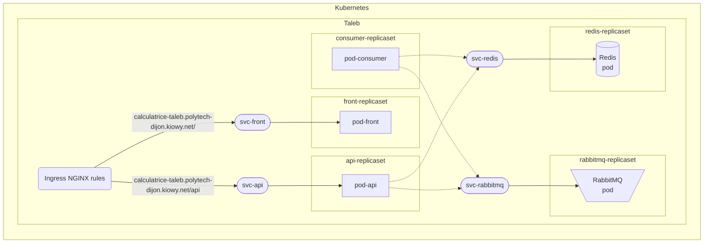
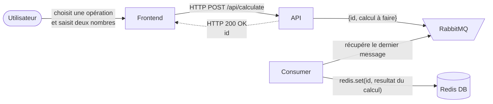
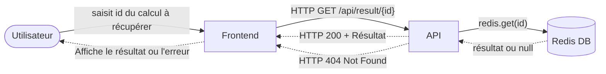

# Kubernetes

### Schema récapitulatif (services et replicasets)


### Fonctionnement
#### Etape 1 : Demande de calcul



#### Etape 2 : Récupération du résultat du calcul


### Commandes utiles

#### Namespace Kubernetes

```shell
kubectl create ns taleb
```
```shell
kubectl config set-context --current --namespace=taleb
```

#### Déploiement Redis

```shell
kubectl apply -f redis-replicaset.yaml
```
```shell
kubectl apply -f redis-service.yaml
```

#### Déploiement RabbitMQ

```shell
kubectl apply -f rabbitmq-replicaset.yaml
```
```shell
kubectl apply -f rabbitmq-service.yaml
```

#### Déploiement Frontend

```shell
kubectl apply -f front-replicaset.yaml
```
```shell
kubectl apply -f front-service.yaml
```

#### Déploiement Ingress

```shell
kubectl apply -f nginx-ingress.yaml
```

#### Déploiement Backend API

```shell
kubectl apply -f api-replicaset.yaml
```
```shell
kubectl apply -f api-service.yaml
```

#### Déploiement Consumer
```shell
kubectl apply -f consumer-replicaset.yaml
```

#### Debugging
```shell
kubectl get pods
```
```shell
kubectl get replicasets
```
```shell
kubectl get svc
```
```shell
kubectl get ingress
```
```shell
kubectl logs <pod-name>
```
```shell
kubectl describe pod <pod-name>
```
```shell
kubectl describe ingress
```

#### Suppression des replicasets

```shell
kubectl delete -f nginx-ingress.yaml
```
```shell
kubectl delete -f front-replicaset.yaml
```
```shell
kubectl delete -f api-replicaset.yaml
```
```shell
kubectl delete -f rabbitmq-replicaset.yaml
```
```shell
kubectl delete -f redis-replicaset.yaml
```
```shell
kubectl delete -f consumer-replicaset.yaml
```

#### Suppression des services

```shell
kubectl delete -f front-service.yaml
```
```shell
kubectl delete -f api-service.yaml
```
```shell
kubectl delete -f rabbitmq-service.yaml
```
```shell
kubectl delete -f redis-service.yaml
```

#### Suppression de toutes les resources

```shell
kubectl delete all --all -n taleb
```

### Problèmes rencontrés
- Remplacer `127.0.0.1` par `svc-api`, `svc-rabbitmq`, et `svc-redis`.
- Problème résolu en changeant le type de service de ClusterIP à LoadBalancer.
- Postman utilisé pour tester les requêtes API.