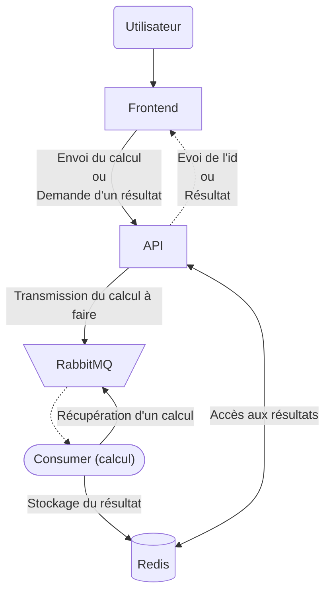

| [](https://www.ube.fr) | Polytech Dijon - 4A - ILIA/SQR <br/> Projet&nbsp;de&nbsp;Virtualisation&nbsp;&amp;&nbsp;Cloud&nbsp;Computing <br/> Calculatrice Cloud Native <br/><br/> **[ EXAMEN PRATIQUE ]** | [](https://polytech.u-bourgogne.fr) |
|:-------------------------------------------------------------|:-------------------------------------------------------------------------------------------------------------------------------------------------------------------------------:|-----------------------------------------------------------------------------------------:|

[](https://docs.docker.com/)
[](https://kubernetes.io/)
[](https://flask.palletsprojects.com/)
[](https://redis.io/)
[](https://rabbitmq.com/)
[](https://nginx.org/)
[](https://www.terraform.io/)
[](https://registry.terraform.io/providers/scaleway/scaleway/latest/docs)
[](https://developer.mozilla.org/fr/docs/Web/HTML)
[](https://developer.mozilla.org/fr/docs/Web/CSS)
[](https://developer.mozilla.org/fr/docs/Web/JavaScript)

## Sommaire
- [Description](#description)
- [Technologies utilisées](#technologies-utilisées)
- [Contenu](#contenu)
- [Déroulement du projet](#déroulement-du-projet)
  - [1. Terraform](#1-terraform)
  - [2. Développement de l'application](#2-développement-de-lapplication)
  - [3. Intégration de la logique demandée](#3-intégration-de-la-logique-demandée)
  - [4. Containerisation](#4-containerisation)
  - [5. Orchestration avec Kubernetes](#5-orchestration-avec-kubernetes)
  - [6. Accès à l'application](#6-accès-à-lapplication)
  - [7. Scan des images avec Trivy](#7-scan-des-images-avec-trivy)
  - [8. Automatisation du déploiement (CI/CD)](#8-automatisation-du-déploiement-cicd)
- [Application](#application)
- [Auteur](#auteur)
## Description
Projet de virtualisation et cloud effectué à Polytech Dijon pour déployer une application de calculatrice cloud native. [Sujet](Sujet.md) ou [source](https://github.com/JeromeMSD/module_virtualisation-et-cloud-computing/blob/main/projet.md)


## Technologies utilisées

- **Frontend :** HTML, CSS, JS
- **Backend :** Flask (Python)
- **Base de données :** Redis
- **Queue de message :** RabbitMQ
- **Serveur web :** Nginx
- **Provisionnement :** Terraform
- **Provider :** Scaleway
- **Containerisation :** Docker
- **Orchestration :** Kubernetes
- **Cloud :** Google Cloud Platform

## Contenu
- [`Application/`](./Application) : Fichiers de l'application web (front-end, back-end, consumer), Dockerfiles associés et docker-compose.
- [`Kubernetes/`](./Kubernetes) : Manifests Kubernetes (Replicaset, Service, Ingress).
- [`Foundation/`](./Foundation) : Terraform (provisionnement de l'infrastructure).
- [`Sujet.md`](./Sujet.md) [source](https://github.com/JeromeMSD/module_virtualisation-et-cloud-computing/blob/main/projet.md).

## Déroulement du projet

### 1. Terraform
- J'ai commencé par utiliser Terraform pour le provisionnement de l'infrastructure. [ici](./Foundation/README.md)

### 2. Développement de l'application
- **Frontend (HTML, CSS, JS) :** Création de l'interface utilisateur.
- **Backend avec Flask (Python) :** Mise en place de l'API pour envoyer les résultats à l'utilisateur comme affiché dans le schéma suivant :

 ```mermaid
   graph TB; 
       A(Utilisateur) --> B[Frontend]
       B -->|"Envoi du calcul"| C[API] -->|Envoi du résultat| B
 ```

### 3. Intégration de la logique demandée
- J'ai intégré RabbitMQ pour gérer la queue de messages et organiser le traitement des calculs via des consommateurs en plus de stocker les résultats dans Redis comme indiqué dans le schéma suivant :



### 4. Containerisation
  - **Docker :** Création des Dockerfiles pour chaque partie de l'application (frontend, backend, consumer). [ici](./Application/README.md)

    - **Docker Compose :** Mise en place d'un fichier `docker-compose.yml` pour faciliter le lancement des 5 conteneurs (frontend, backend, consumer, Redis, RabbitMQ).

### 5. Orchestration avec Kubernetes
  - Création des manifests Kubernetes pour déployer l'application [ici](./Kubernetes/README.md) et y accéder via ce lien : [Calculatrice Cloud Native](http://calculatrice-taleb.polytech-dijon.kiowy.net).

### 6. Accès à l'application
  - Une fois l'application fonctionnelle avec Docker et Kubernetes, l'application est accessible via un nom de domaine.

### 7. Scan des images avec Trivy
  - J'ai également scanné les images Docker avec Trivy pour identifier les vulnérabilités. [ici](./Application/README.md)

### 8. Automatisation du déploiement (CI/CD)
- J'ai automatisé le build et le push des images Docker sur le registry de Google Cloud Platform en utilisant GitHub Actions. [ici](../.github/workflows/build_push_images.yaml)
- J'ai également automatisé le déploiement de l'application avec Kubernetes en utilisant GitHub Actions. [ici](../.github/workflows/deploy_images.yaml)

> [!NOTE]
> L'ensemble des problématiques rencontrées et des solutions apportées sont détaillées dans les fichiers `README.md` de chaque partie du projet.
> - [Application](./Application/README.md)
> - [Kubernetes](./Kubernetes/README.md)
> - [Foundation](./Foundation/README.md)


## Application
> [!IMPORTANT]
> L'application est désormais accessible via ce lien : [Calculatrice Cloud Native](http://calculatrice-taleb.polytech-dijon.kiowy.net).
> 
> Veuillez ajouter la ligne suivante `34.77.144.136 calculatrice-taleb.polytech-dijon.kiowy.net` dans votre fichier `hosts` :
>  - **Windows :** `C:\Windows\System32\drivers\etc\hosts`
>  - **Linux :** `/etc/hosts`

## Auteur
**Nour Eddine TALEB**

