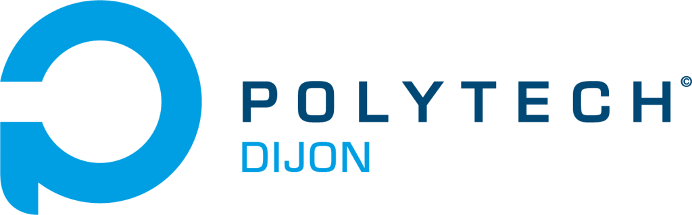
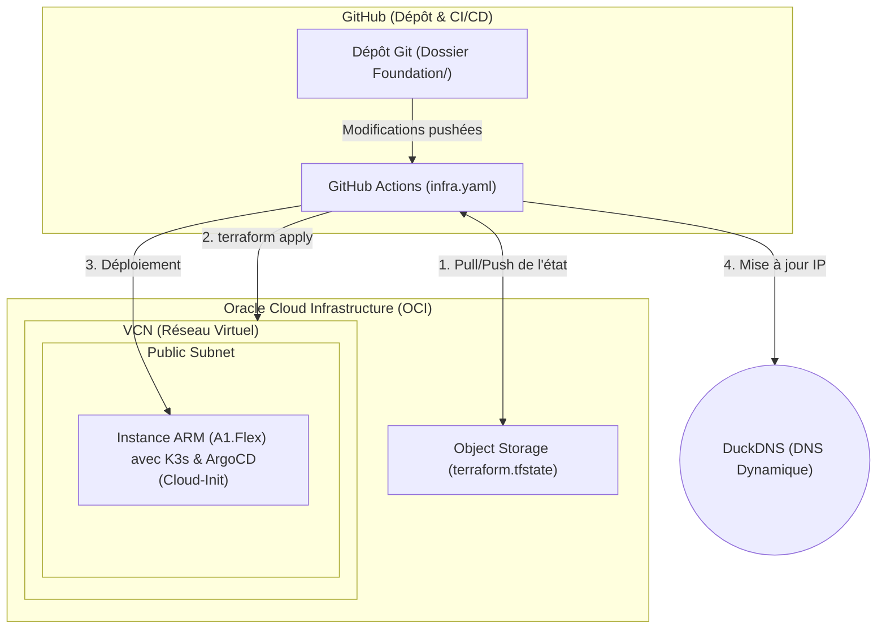
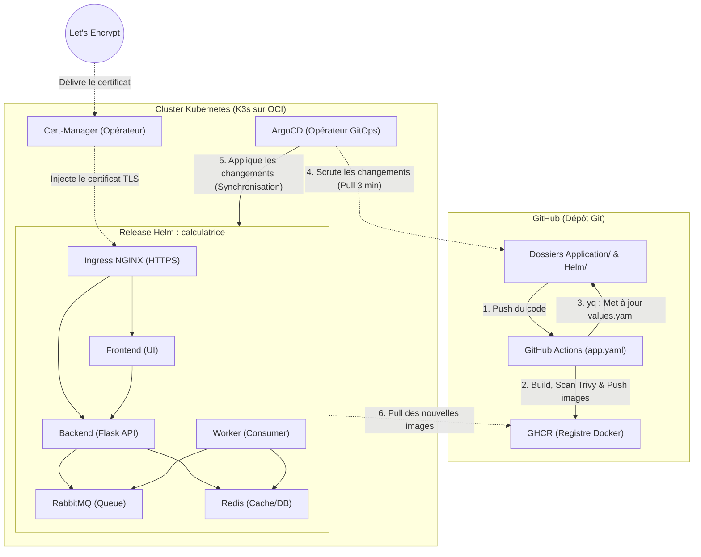

|  | Polytech Dijon - 4A - ILIA/SQR   Projet&nbsp;de&nbsp;Virtualisation&nbsp;&amp;&nbsp;Cloud&nbsp;Computing   Calculatrice Cloud Native    **[ EXAMEN PRATIQUE ]** |  |
|:-------------------------------------------------------------|:-------------------------------------------------------------------------------------------------------------------------------------------------------------------------------:|---------------------------------------------------------------------------------:|

Contient le projet du module de Virtualisation & Cloud Computing et les travaux dirigés réalisés à Polytech Dijon.

- **Travaux dirigés 👉 [ici](TD)**
- **Projet de Calculatrice Cloud Native ci-dessous 👇** | ou live démo **👉 [Calculatrice Cloud Native](https://calculatrice-taleb.duckdns.org/)**

## Sommaire
- [Description](#description)
- [Technologies utilisées](#technologies-utilisées)
- [Contenu du Dépôt](#contenu-du-dépôt)
- [Architecture Globale](#architecture-globale)
  - [1. Infrastructure et Provisionnement (Terraform)](#1-infrastructure-et-provisionnement-terraform)
  - [2. Déploiement Applicatif et GitOps (ArgoCD & GitHub Actions)](#2-déploiement-applicatif-et-gitops-argocd--github-actions)
- [Déroulement et Évolution du Projet](#déroulement-et-évolution-du-projet)
- [Accès à l'Application](#accès-à-lapplication)
- [Voir aussi](#voir-aussi)

## Description
Projet de virtualisation et cloud effectué à Polytech Dijon. L'objectif de ce projet est de déployer une application de **Calculatrice Cloud Native** en utilisant l'état de l'art des technologies DevOps et Cloud : Infrastructure as Code, Conteneurisation, Orchestration Kubernetes et déploiement continu GitOps. 
[Sujet complet de l'examen](Sujet.md) ou [source](https://github.com/JeromeMSD/module_virtualisation-et-cloud-computing/blob/main/projet.md)

## Technologies utilisées

- **Frontend :** HTML, CSS, JS
- **Backend :** Flask (Python)
- **Base de données :** Redis
- **Queue de message :** RabbitMQ
- **Serveur web :** Nginx
- **Provisionnement (IaC) :** Terraform & Terragrunt
- **Containerisation :** Docker
- **Scan des images :** Trivy
- **Orchestration :** Kubernetes (K3s)
- **Packaging :** Helm
- **Sécurité (HTTPS) :** Cert-Manager & Let's Encrypt
- **Déploiement Continu (GitOps) :** ArgoCD
- **CI/CD :** GitHub Actions
- **Cloud :** Oracle Cloud Infrastructure (OCI)
- **Registre :** GitHub Container Registry (GHCR)

## Contenu du Dépôt
Le projet est découpé en plusieurs dossiers, chacun documenté par son propre `README.md` détaillant ses spécificités techniques et les difficultés rencontrées :

- [`Foundation/`](./Foundation) : Code Terraform pour le provisionnement de l'infrastructure sur Oracle Cloud Infrastructure (OCI).
- [`Application/`](./Application) : Code source (Frontend, Backend API, Consumer RabbitMQ) et Dockerfiles de l'application.
- [`Helm/`](./Helm) : Le chart Helm permettant de packager l'ensemble des ressources Kubernetes de l'application.
- [`GitOps/`](./GitOps) : Configuration ArgoCD pour synchroniser automatiquement le cluster Kubernetes avec ce dépôt.
- [`Kubernetes/`](./Kubernetes) : *[Historique/Déprécié]* Les anciens manifestes Kubernetes bruts, remplacés par Helm.
- [`Terragrunt/`](./Terragrunt) : *[Exemple pédagogique]* Structure démontrant l'utilisation de Terragrunt pour séparer des environnements virtuels (Dev, Preprod, Prod) sans dupliquer le code Terraform.
- [`.github/workflows/`](./.github/workflows) : Pipelines d'intégration et de déploiement continus (CI/CD).

---

## Architecture Globale

Plutôt qu'un long discours, voici la modélisation complète du fonctionnement du projet, scindée en deux parties : l'infrastructure physique et le flux applicatif.

### 1. Infrastructure et Provisionnement (Terraform)
Ce schéma illustre comment l'infrastructure cloud de base est créée et maintenue sur Oracle Cloud de manière automatisée.

```mermaid
graph TB
    subgraph GitHub ["GitHub (Dépôt & CI/CD)"]
        code["Dépôt Git (Dossier Foundation/)"]
        gha["GitHub Actions (infra.yaml)"]
        code -->|"Modifications pushées"| gha
    end

    subgraph OCI ["Oracle Cloud Infrastructure (OCI)"]
        Bucket["Object Storage (terraform.tfstate)"]
        subgraph VCN ["VCN (Réseau Virtuel)"]
            subgraph Subnet ["Public Subnet"]
                VM["Instance ARM (A1.Flex) <br> avec K3s & ArgoCD (Cloud-Init)"]
            end
        end
    end
    
    DuckDNS(("DuckDNS (DNS Dynamique)"))
    
    gha <-->|"1. Pull/Push de l'état"| Bucket
    gha -->|"2. terraform apply"| VCN
    gha -->|"3. Déploiement"| VM
    gha -->|"4. Mise à jour IP"| DuckDNS
```

### 2. Déploiement Applicatif et GitOps (ArgoCD & GitHub Actions)
Ce schéma illustre le cycle de vie du code applicatif, sa conteneurisation, et son déploiement 100% automatisé sur le cluster Kubernetes.

```mermaid
graph TB
    subgraph GitHub ["GitHub (Dépôt Git)"]
        code["Dossiers Application/ & Helm/"]
        gha["GitHub Actions (app.yaml)"]
        ghcr["GHCR (Registre Docker)"]
        
        code -->|"1. Push du code"| gha
        gha -->|"2. Build, Scan Trivy & Push images"| ghcr
        gha -->|"3. yq : Met à jour values.yaml"| code
    end

    subgraph Cluster ["Cluster Kubernetes (K3s sur OCI)"]
        ArgoCD["ArgoCD (Opérateur GitOps)"]
        CertManager["Cert-Manager (Opérateur)"]
        
        subgraph Helm ["Release Helm : calculatrice"]
            Ingress["Ingress NGINX (HTTPS)"]
            Front["Frontend (UI)"]
            API["Backend (Flask API)"]
            Consumer["Worker (Consumer)"]
            RabbitMQ["RabbitMQ (Queue)"]
            Redis["Redis (Cache/DB)"]
            
            Ingress --> Front
            Ingress --> API
            Front --> API
            API --> RabbitMQ
            Consumer --> RabbitMQ
            API --> Redis
            Consumer --> Redis
        end
        ArgoCD -->|"5. Applique les changements (Synchronisation)"| Helm
        CertManager -.->|"Injecte le certificat TLS"| Ingress
    end
    
    LetsEncrypt(("Let's Encrypt")) -.->|"Délivre le certificat"| CertManager
    ArgoCD -.->|"4. Scrute les changements (Pull 3 min)"| code
    Helm -.->|"6. Pull des nouvelles images"| ghcr
```

---

## Déroulement et Évolution du Projet

Le projet a évolué par itérations successives pour atteindre l'état de l'art actuel :

1. **Développement de l'application :** Création du frontend, de l'API Flask, et implémentation de RabbitMQ et Redis pour traiter les calculs de manière asynchrone via des workers (consumers).
2. **Conteneurisation (Docker) :** Création de Dockerfiles optimisés pour chaque brique de l'application et sécurisation via des analyses de vulnérabilités (Trivy).
3. **Infrastructure as Code (Terraform) :** Automatisation du déploiement d'une instance ARM (A1.Flex) sur Oracle Cloud Infrastructure (OCI) et installation de Kubernetes (K3s) au démarrage via Cloud-Init.
4. **Orchestration (Kubernetes) :** Déploiement initial de l'application via des fichiers YAML bruts (Services, Ingress, Deployments).
5. **Sécurité (HTTPS) :** Déploiement de Cert-Manager avec un `ClusterIssuer` pointant vers Let's Encrypt pour automatiser la génération et le renouvellement des certificats TLS gratuits.
6. **Packaging (Helm) :** Migration de tous les manifestes K8s (y compris ceux liés à Cert-Manager) vers un Chart Helm unifié permettant la configuration dynamique (via `values.yaml`).
7. **GitOps (ArgoCD) :** Déploiement d'ArgoCD sur le cluster pour qu'il surveille le dépôt GitHub et se charge lui-même d'appliquer les mises à jour Helm sur le cluster.
8. **Automatisation Complète (GitHub Actions) :** Mise en place d'un pipeline CI/CD final. Lors d'un changement de code applicatif, GitHub Actions build les nouvelles images Docker, les pousse sur GHCR, met à jour le fichier `values.yaml`, et ArgoCD synchronise instantanément le cluster de production.
9. **Séparation des Environnements (Terragrunt) :** Mise en place d'une structure pédagogique démontrant l'utilisation de Terragrunt pour gérer facilement différents environnements (Dev, Preprod, Prod) sans dupliquer le code Terraform.

---

## Accès à l'Application

> [!IMPORTANT]
> L'application est actuellement déployée, sécurisée, et accessible publiquement via ce lien : 
> **👉 [Calculatrice Cloud Native](https://calculatrice-taleb.duckdns.org/)**

## Voir aussi
- [`Application/`](./Application) : Fichiers de l'application web (front-end, back-end, consumer), Dockerfiles associés et docker-compose.
- [`Foundation/`](./Foundation) : Terraform (provisionnement de l'infrastructure).
- [`Helm/`](./Helm) : Le chart Helm qui est surveillé et déployé par ArgoCD.
- [`GitOps/`](./GitOps) : Configuration ArgoCD pour la synchronisation du cluster (déploiement continu).
- [`.github/workflows/`](./.github/workflows) : Fichier GitHub Actions pour automatiser le provisionnement de l'infrastructure et le déploiement de l'application.
- [`Kubernetes/`](./Kubernetes) : Manifests Kubernetes bruts (historique).
- [`Terragrunt/`](./Terragrunt) : Configuration Terragrunt pour gérer plusieurs environnements (Dev, Preprod, Prod).
- [`Sujet.md`](./Sujet.md) ou [source](https://github.com/JeromeMSD/module_virtualisation-et-cloud-computing/blob/main/projet.md).

- [🔼 Back to Top](#readme)