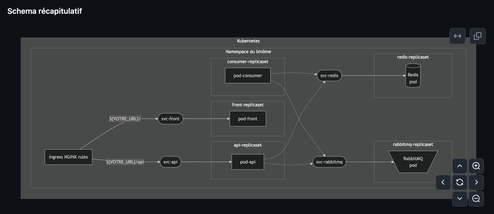

### PROJET - Communication vers le cluster

Voici plusieurs informations concernant la fin du projet :

1. Suite aux problèmes de communications entre Frontend et Backend dans le projet, merci à Charles Meunier pour la solution utilisant le double port-forward 🙂 . Voici un changement correctif dans le sujet :
   
**Pourquoi ça ne fonctionnait pas ?** Votre navigateur utilisait l'IP interne au cluster pour accéder au backend, elle est inaccessible publiquement.

Pour contrer ce comportement, nous allons mettre en place une redirection des requêtes arrivant sur l'URL du Frontend quand le chemin est "/api". Je vous laisse poursuivre vos recherches sur l'Ingress Kubernetes et compléter votre Ingress rule pour mettre en place cette redirection (cf. [https://kubernetes.io/docs/concepts/services-networking/ingress/#simple-fanout](https://kubernetes.io/docs/concepts/services-networking/ingress/#simple-fanout)).

Une fois l'ingress rule modifiée, modifiez dans votre Frontend l'URL de l'API pour mettre "calculatrice-<nombinome1>-<nombinome2>.polytech-dijon.kiowy.net", ainsi le navigateur appellera à nouveau le point d'entrée du cluster pour réaliser la communication Frontend -> Backend.

**IMPORTANT : Frontend -> Backend est la seule communication pour laquelle ce changement est nécessaire.**

2. Veillez à utiliser une Ingress Rule de classe NGINX : `ingressClassName: nginx`.

3. **Vous n'avez pas besoin de Service de type NodePort ou LoadBalancer**. Merci de les remplacer par des Services de type ClusterIP.

4. **Vous n'avez pas besoin d'installer de Controller d'Ingress dans le cluster**, c'est déjà fait. La création d'une Ingress Rule est suffisante pour ouvrir un point d'entrée dans le cluster (cf. [https://kubernetes.io/docs/concepts/services-networking/ingress/#simple-fanout](https://kubernetes.io/docs/concepts/services-networking/ingress/#simple-fanout)).